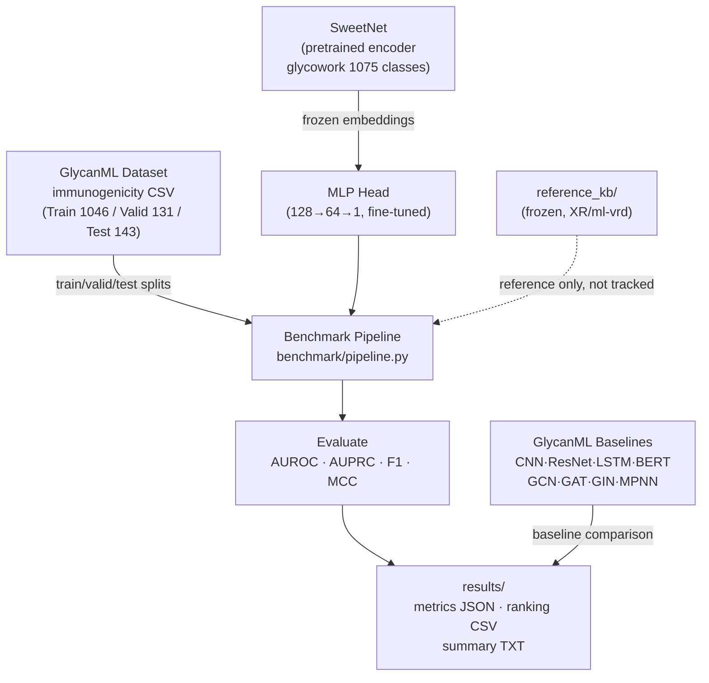

# Relationship Map

```mermaid
graph TD
    DS["GlycanML Dataset\nimmunogenicity CSV\n(Train 1046 / Valid 131 / Test 143)"]
    SN["SweetNet\n(pretrained encoder\nglycowork 1075 classes)"]
    MLP["MLP Head\n(128→64→1, fine-tuned)"]
    BM["Benchmark Pipeline\nbenchmark/pipeline.py"]
    EVAL["Evaluate\nAUROC · AUPRC · F1 · MCC"]
    BL["GlycanML Baselines\nCNN·ResNet·LSTM·BERT\nGCN·GAT·GIN·MPNN"]
    KB["reference_kb/\n(frozen, XR/ml-vrd)"]
    OUT["results/\nmetrics JSON · ranking CSV\nsummary TXT"]

    DS -->|train/valid/test splits| BM
    SN -->|frozen embeddings| MLP
    MLP --> BM
    BM --> EVAL
    EVAL --> OUT
    BL -->|baseline comparison| OUT
    KB -.->|reference only, not tracked| BM
```
